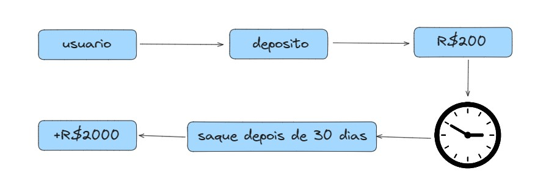

<p align="center">
  <a href="http://nestjs.com/" target="blank"></a>
</p>

[circleci-image]: https://img.shields.io/circleci/build/github/nestjs/nest/master?token=abc123def456
[circleci-url]: https://circleci.com/gh/nestjs/nest

# Urubu Banking System

O Urubu Banking System é uma aplicação de demonstração de um sistema bancário básico desenvolvido com o framework NestJS. Ele segue a lógica do "Urubu do PIX", permitindo que os usuários realizem operações como depósito, saque, transferência e verifiquem o histórico de transações. O sistema também inclui uma função de atualização diária dos saldos das contas com uma rentabilidade diaria de 8,5%.

## Regra de Negócio
<p align="center">
  
</p>

## Funcionalidades

- Realizar depósitos em contas de usuário.
- Realizar saques de contas de usuário.
- Transferir dinheiro entre contas.
- Verificar o saldo de uma conta.
- Verificar o histórico de transações de uma conta.
- Atualização diária automática dos saldos das contas.

##Executando o aplicativo

Usando Docker
Certifique-se de ter o Docker instalado em seu sistema.
Na raiz do projeto, execute o seguinte comando para iniciar o aplicativo usando o Docker Compose:
```bash
$ docker-compose up
```
O aplicativo estará disponível em http://localhost:3000.

## Instalação

1. Clone o repositório para o seu ambiente local.
2. Navegue até o diretório do projeto e instale as dependências usando o comando:

```bash
$ pnpm install
```

3. Crie um arquivo `.env` na raiz do projeto e defina as variáveis de ambiente necessárias, como as configurações do banco de dados.
4. Execute o servidor de desenvolvimento com o comando:

## Executando o aplicativo

```bash
# development
$ pnpm run start

# watch mode
$ pnpm run start:dev

# production mode
$ pnpm run start:prod
```

## Configuração do Banco de Dados com Prisma

1. Certifique-se de ter definido as configurações de banco de dados corretamente no arquivo `.env`.
2. Execute as migrações do Prisma para criar o esquema do banco de dados com o comando:
```bash
#prisma migrate
npx prisma migrate dev
```

## Teste

```bash
# unit tests
$ pnpm run test

# e2e tests
$ pnpm run test:e2e

# test coverage
$ pnpm run test:cov
```

## Rotas de Usuários

- **GET /user/list-users**: Lista todos os usuários cadastrados.
- **POST /user/create-user**: Cria um novo usuário.

## Rotas da API

- **POST /urubu/deposit**: Realiza um depósito em uma conta.
- **POST /urubu/withdraw**: Realiza um saque de uma conta.
- **POST /urubu/transfer**: Realiza uma transferência entre contas.
- **GET /urubu/balance/:username**: Obtém o saldo de uma conta.
- **GET /urubu/transaction-history/:username**: Obtém o histórico de transações de uma conta.

## Contribuição

Contribuições são bem-vindas! Se você quiser melhorar este projeto, sinta-se à vontade para enviar um pull request.
## Autor

- Author - [Edson Costa](@ecsistem)

## Licensa

Nest is [MIT licensed](LICENSE).
